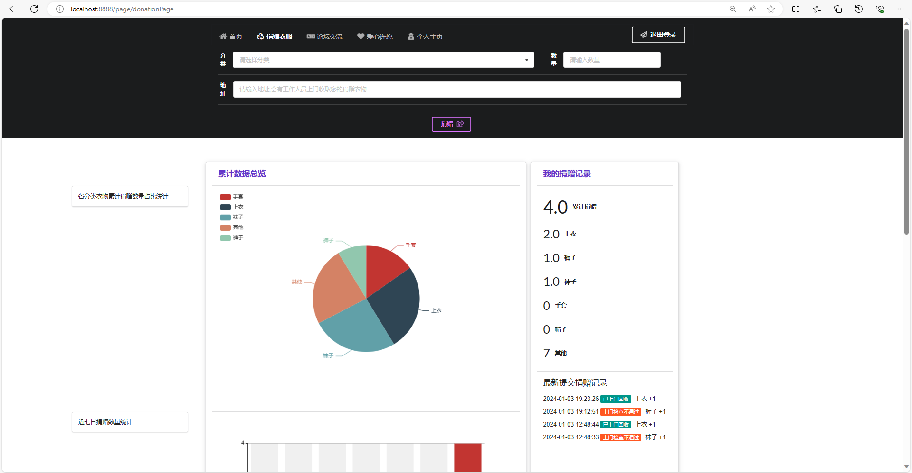
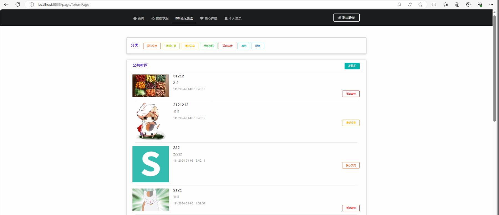
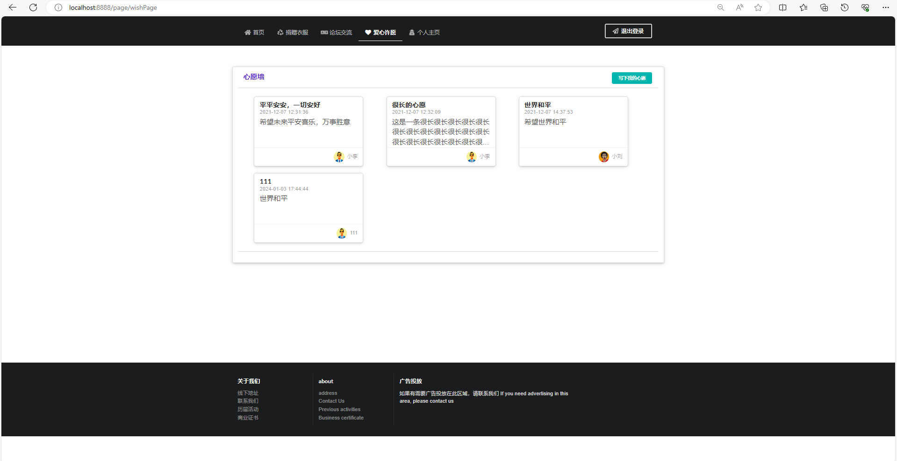
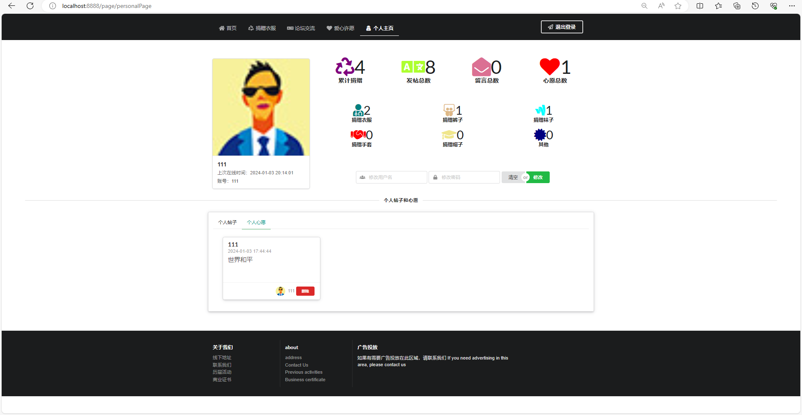
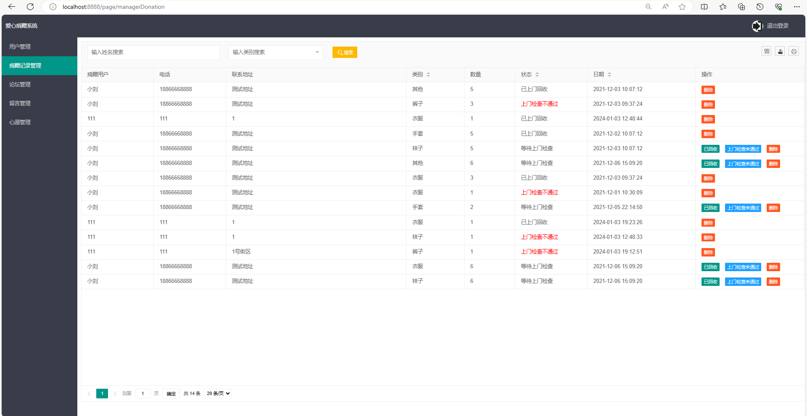
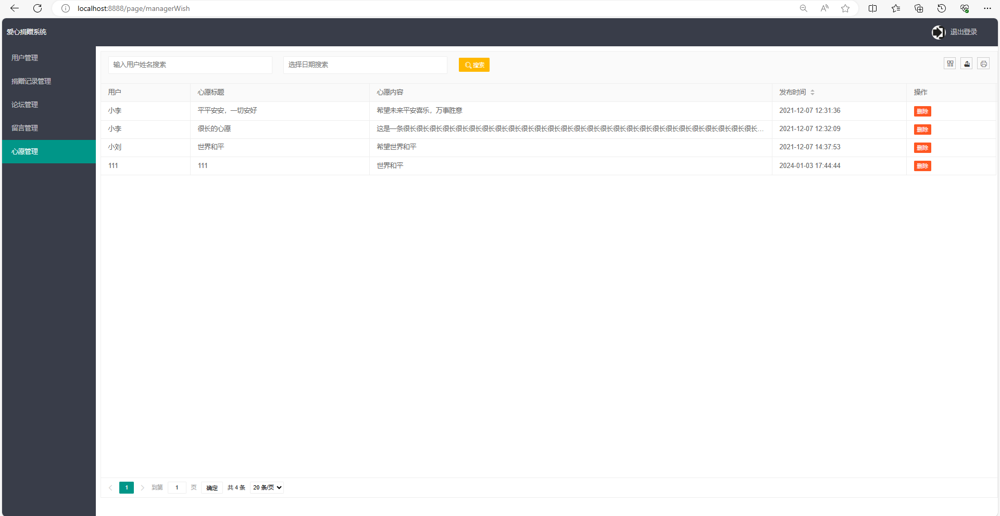

# 物资捐赠管理系统
### 9.9￥ 获取完整源码+sql，需要加Q：3808981644 备用Q：3577148218
### 有问题，或者需要协助调试运行项目的也可联系
### 获取更多项目，关注公众号：编程项目集

### 一、介绍

基于springboot的爱心捐赠管理系统

开发语言：java

运行环境:idea或eclipse 数据库:mysql

技术：springboot+mybatis+html+layui+echarts

爱心捐赠系统（用户端+管理端）

用户端功能模块：登录+注册+衣物捐赠+捐赠浏览+论坛交流+帖子留言+爱心许愿+个人主页

管理端功能模块：登录+用户管理+捐赠记录管理+论坛管理+留言管理+心愿管理

### 二、系统部分功能页面展示

### 9.9￥ 获取完整源码+sql，附赠万字论文参考，需要加Q：3808981644 备用Q：3577148218
### 有问题，或者需要协助调试运行项目的也可联系

